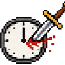
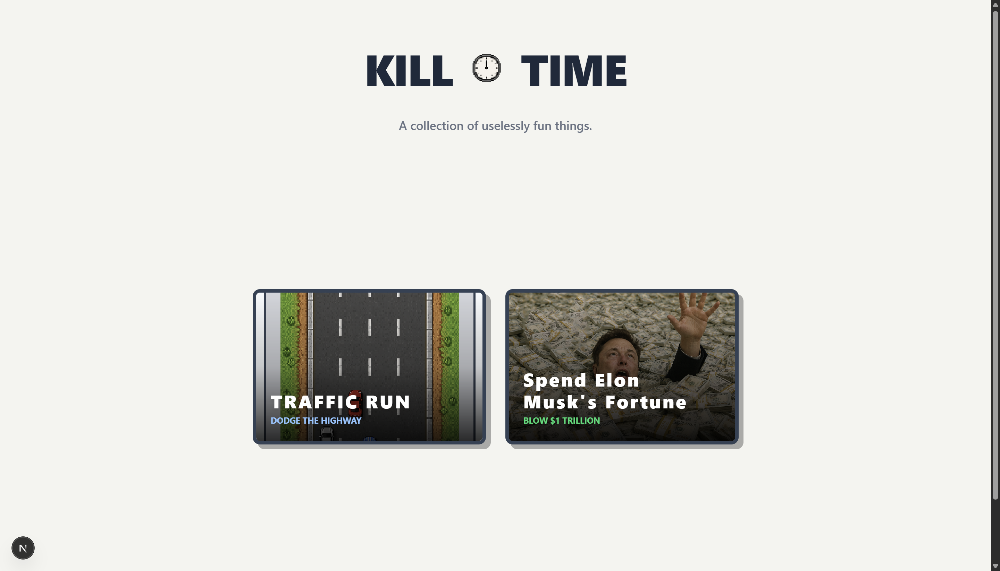

  
  <h1>KillTime</h1>
  
<strong>A collection of uselessly fun things to help you kill time.</strong>

  
  

 

  

## 🎮 The Games

Currently, KillTime features two highly addictive mini-games:

*   **🚗 Traffic Run:** A fast-paced, 8-bit retro highway dodger built entirely in HTML5 Canvas. Features scaling difficulty, responsive pixel-art UI, audio controls, and a real-time **Global Leaderboard**.
*   **💸 Spend Elon's Fortune:** A neo-brutalist shopping simulator. Try to blow through a $1,000,000,000,000 net worth by buying everything from a cup of coffee to the entire GDP of New Zealand.

## 🛠️ Tech Stack

*   **Framework:** [Next.js](https://nextjs.org/) (App Router)
*   **Styling:** [Tailwind CSS](https://tailwindcss.com/)
*   **Animations:** [Framer Motion](https://www.framer.com/motion/)
*   **Game Engine (Traffic Run):** HTML5 `<canvas>` + `requestAnimationFrame`
*   **Database (Leaderboards):** [Upstash Redis](https://upstash.com/) (Serverless KV)
*   **Deployment:** [Vercel](https://vercel.com/)